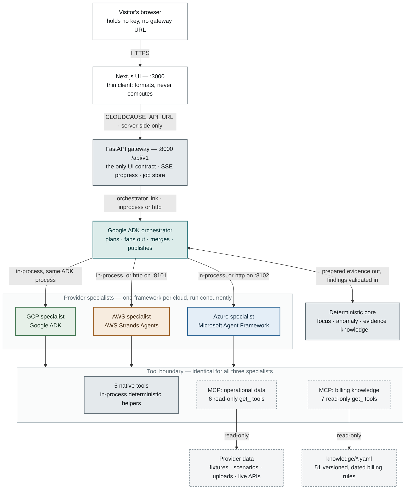

# CloudCause

**Evidence-grounded multi-cloud cost spike investigator.** It answers one question:
why did AWS, Azure, or Google Cloud spending increase, what evidence identifies the
cause, and what should a human consider doing about it?

[](https://cloudcause-web-3afpyx6hyq-uc.a.run.app)
[](https://github.com/isomer04/cloudcause/actions/workflows/offline-ci.yml)
[](LICENSE)

Not another billing dashboard. Deterministic Python measures the money, three agent
frameworks investigate the cause, and every conclusion carries evidence IDs plus a
versioned billing rule with an official source. Read-only by construction: no tool
in the system can delete, stop, scale, or modify a cloud resource.

## Live demo

### **[cloudcause-web-3afpyx6hyq-uc.a.run.app](https://cloudcause-web-3afpyx6hyq-uc.a.run.app)**

No signup, no key, nothing to install. Pick the `default` scenario and press
**Investigate**. The gateway's OpenAPI browser is at
[/docs](https://cloudcause-api-3afpyx6hyq-uc.a.run.app/docs).

> The demo scales to zero when idle, so the first request after a quiet period waits
> while Cloud Run pulls the image and starts the gateway. The page says so and retries
> on its own. Live-agent runs also share one rate-limit bucket across all visitors,
> because the deployment does not trust proxy headers and cannot tell visitors apart.

Want to try it on your own bill? The **Your data** flow accepts an AWS CUR 2.0, Azure
Cost Management, or Google Cloud billing export — or one of the
[synthetic provider exports](fixtures/uploads/README.md) if you would rather not upload
a real one. Uploaded bytes are parsed from the request stream and discarded: nothing
raw reaches disk and no row value is ever logged.

It runs on Google Cloud from [`terraform/gcp/`](terraform/gcp/) on **exactly three
services** — Cloud Run, Artifact Registry, Cloud Build. The topology, the deliberate
omissions, and the cost lever are in
[docs/deployment-runbook.md](docs/deployment-runbook.md).

## Run it offline

No AWS, Azure, or Google Cloud account. No model API key. No network.
Requires Python 3.11+, [uv](https://docs.astral.sh/uv/), and Node with npm.

```bash
make setup
make dev
```

The API runs at http://127.0.0.1:8000/docs and the UI at http://localhost:3000. Press
Ctrl+C to stop both, and `make help` for API-only, web-only, test, lint, build,
type-check, and evaluation commands. Prefer the terminal? One report, no services:
`uv run python evaluations/run_evaluation.py`.


## What one run produces

The demo fixture plants three causes across three clouds plus a quieter fourth. A real
run against it, reproducible offline:

```
Spend         618.66 USD  ->  1048.92 USD      +430.26 USD  (+69.5%)
Attributed    419.60 USD      Unattributed 10.66 USD     reconciled within tolerance
Findings      4               Validation issues 0        Warnings 0
```

| Provider | Cause identified | Impact | Confidence |
| --- | --- | --- | --- |
| GCP | Exposed API key drives Cloud Translation usage from unrecognized networks | +161.60 USD | 0.87 |
| AWS | Route change sends S3 traffic through a NAT Gateway after the VPC endpoint is deleted | +126.00 USD | 0.84 |
| Azure | Function App retry loop after a deployment | +103.20 USD | 0.83 |
| AWS | Forgotten sandbox EC2 instance | +28.80 USD | 0.79 |

The residual 10.66 USD is diffuse drift on untagged, resource-less SKUs, planted
deliberately: reconciliation guarantees the remainder is measured and declared, not
that it is zero, and a report whose parts do not balance within tolerance does not
publish. Confidence is derived from four independent axes rather than decorative —
the `aws-cost-only-unexplained` scenario publishes a genuine +72.00 USD spike as
`unexplained_increase` at 0.39, naming the sources that would settle it instead of a
cause it cannot evidence.

## Measured results

`evaluations/` scores the system against 13 seeded scenarios with known causes,
including five adversarial ones: a pricing change that is not a usage change, delayed
billing data, a partial trailing day, untagged resources, and a real spike with no
evidence but the bill, which must refuse to name a cause.

| Metric | Result |
| --- | --- |
| Scenarios passed | 13 / 13 |
| Root cause ranked in top 3 | 100% |
| Cost attribution accuracy | 100% |
| Claims backed by evidence | 100% |
| Unsupported claims per run | 0.00 |
| Offline test suite | 433 passed, 15 skipped (448 with PostgreSQL) |
| Cost to reproduce all of it | $0.00 |

## Architecture

A Next.js server route proxies every call, so the browser never learns the gateway's
address and the UI stays a thin client that formats and never computes. Below the
gateway, Google ADK coordinates and owns GCP, AWS Strands owns AWS, and Microsoft
Agent Framework owns Azure — three frameworks meeting at one HTTP contract, sharing
one read-only tool boundary of 13 allowlisted `get_` MCP tools plus 5 native ones.



A run moves through seven stages — `normalize`, `analyze`, `plan`, `investigate`,
`validate`, `reconcile`, `report` — and the agents get exactly one of them. Those are
the literal stage names on the SSE stream, so the progress you watch is the pipeline
itself. Contracts, the repository layout, and the design rationale are in
[docs/architecture.md](docs/architecture.md).

## Running with live agents

Offline is a complete system run but not an AI-quality test. Add a model key and both
paths are live in the same process — choose **Live AI agents** or **Deterministic
playbooks** per run, with no mode switch and no redeploy.

| Specialist | Framework | Model |
| --- | --- | --- |
| Google Cloud | Google ADK | `gemini-3.5-flash-lite` |
| AWS | AWS Strands | `gpt-4.1-mini` |
| Azure | Microsoft Agent Framework | `gpt-4.1-mini` |

Set `OPENAI_API_KEY` and `GOOGLE_API_KEY`, then `curl localhost:8000/health` reports
`live_agents_available`. Every finding and report carries `agent_mode`, so a finished
dossier still answers which path produced it. Full setup, model overrides, and the
rate-limit ceilings behind the model choice:
[docs/usage.md](docs/usage.md#running-with-live-agents).

## Scope and honest limits

* **The gateway is unauthenticated.** A public deployment that accepts uploads needs
  authentication and per-user isolation first, and a model key on a reachable instance
  can be spent by anyone who reaches it. The live demo accepts uploads because a cost
  investigator that cannot read a bill demonstrates nothing — but it is a
  demonstration, not a service to send a real bill to in confidence.
* **No live cloud connectors yet.** `CLOUDCAUSE_DATA_MODE=live` raises a clear error
  rather than pretending. The three working input paths are demo fixtures, 13 seeded
  scenarios, and your own uploaded cost export.
* **A cost export alone cannot evidence a cause**, and the system says so instead of
  guessing. Metrics, audit events, inventory, or provider recommendations for the same
  period are what raise a finding to a specific mechanism.
* **SSE progress assumes a single gateway process.** Horizontal scaling needs sticky
  sessions or Redis fan-out; the live demo runs at `max_instances = 1`.

## Documentation

| Document | What it covers |
| --- | --- |
| [docs/architecture.md](docs/architecture.md) | System shape: services, topology, tool strategy, contracts, security posture, design rationale |
| [docs/usage.md](docs/usage.md) | Runtime modes, live agents, uploads, history backends, containers, every command |
| [docs/deployment-runbook.md](docs/deployment-runbook.md) | The live Cloud Run deployment: topology, what deploys, the cost lever, what not to do |
| [docs/testing-strategy.md](docs/testing-strategy.md) | Why the suite is layered the way it is, and how to run each layer |
| [docs/billing-knowledge.md](docs/billing-knowledge.md) | The versioned rule store, its MCP server, and the update workflow |
| [docs/adr/](docs/adr/) | Why individual forks in the road were taken, one file per decision |
| [fixtures/README.md](fixtures/README.md) | The synthetic data shapes and the generator |
| [evaluations/README.md](evaluations/README.md) | Scenarios, expectations, and how scoring works |

## Attribution and licence

Released under the [PolyForm Noncommercial License 1.0.0](LICENSE): read, run, fork,
modify, and share it freely for any noncommercial purpose. Commercial use requires a
separate licence; open an issue to ask. This is a *source-available* licence, not an
Open Source licence as the [OSI defines it](https://opensource.org/osd), because
clause 6 forbids restricting a field of endeavour. Versions published before this
change remain under the MIT licence they were released with.

The three agent frameworks were learned from Ed Donner's course examples; that
material is not redistributed here and nothing under `packages/`, `services/`, `api/`,
or `web/` is derived from it. Provider billing behaviour is summarized from the
official documentation linked in each rule under `knowledge/`. Dependencies keep their
own licences.
