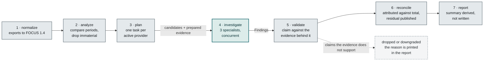

# Architecture

How CloudCause is shaped and why the pieces sit where they do.
[`../README.md`](../README.md) is the overview, [`usage.md`](usage.md) is the operator's
guide, [`adr/`](adr/) records individual decisions, and
[`billing-knowledge.md`](billing-knowledge.md) covers the versioned rule subsystem.
Where this document and the code disagree, the code is right.

CloudCause is built on three agent frameworks — Google ADK, Microsoft Agent Framework,
and AWS Strands — one per cloud, meeting at an HTTP contract. The reasoning for that is
[`adr/0003`](adr/0003-framework-per-cloud.md).

## 1. Problem

Cloud users frequently discover unexplained cost increases caused by forgotten resources, networking charges, retry loops, compromised API keys, untagged infrastructure, and unexpected AI inference usage. Investigating these increases often requires manually switching among billing dashboards, resource inventories, metrics, and audit logs.

CloudCause answers:

> Why did our AWS, Azure, or Google Cloud spending increase, what evidence identifies the cause, and what safe action should a human consider?

CloudCause is not another general billing dashboard. Its primary feature is evidence-backed root-cause investigation across multiple clouds.

## 2. Framework responsibilities

### Google ADK

Google ADK is the top-level orchestrator and GCP specialist. It plans investigations, starts provider specialists concurrently, evaluates their findings, requests missing evidence, and prepares the final report.


ADK responsibilities:

- Interpret the investigation question
- Create the provider investigation plan
- Start AWS, Azure, and GCP analysis concurrently
- Perform GCP-specific investigation
- Compare findings across providers
- Reject or downgrade unsupported claims
- Coordinate human approval
- Produce the final evidence report

GCP data sources:

- Cloud Billing export to BigQuery
- Cloud Asset Inventory
- Cloud Monitoring and Logging
- Cloud Audit Logs
- Recommender/Active Assist
- Resource Manager

### Microsoft Agent Framework

MAF is the Azure specialist. It uses the Python implementation so all three services share the same primary language.

MAF responsibilities:

- Query Azure Cost Management
- Search Azure Resource Graph
- Analyze Azure Monitor metrics
- Correlate cost changes with Activity Log events
- Read Azure Advisor recommendations
- Identify idle, orphaned, or untagged resources
- Return structured findings to ADK

### AWS Strands

Strands is the AWS specialist.

Strands responsibilities:

- Query AWS Cost Explorer
- Read Cost Anomaly Detection findings
- Search Resource Explorer and tagging data
- Analyze CloudWatch metrics
- Correlate changes with CloudTrail
- Read Compute Optimizer recommendations
- Detect common NAT Gateway, transfer, storage, and idle-resource waste
- Return structured findings to ADK

## 3. Service topology

```text
Next.js UI (thin client: formats, never computes)
        |
   HTTP + SSE
        |
FastAPI gateway (api)  <-- the only UI contract
        |
Google ADK coordinator + GCP specialist
        |                                     |
HTTP contract                          HTTP contract
        |                                     |
        AWS Strands investigator                MAF Azure investigator
                        |                                     |
        MCP: AWS operational data               MCP: Azure operational data
        MCP: billing knowledge                  MCP: billing knowledge
                        \_____________________________________/
                                      |
                    FOCUS 1.4 normalization + deterministic analytics
                                      |
                    investigation history (PostgreSQL, or nothing)
```

Each framework runs in its own service. That avoids dependency conflicts between three
agent SDKs and demonstrates framework-independent integration: the ADK service calls
MAF and Strands through versioned HTTP contracts rather than importing all three
frameworks into one process. See [`adr/0003`](adr/0003-framework-per-cloud.md).

Provider exports are normalized to a FOCUS 1.4 projection before anything is compared,
which is what makes one comparison engine work across three clouds instead of three
engines.

### 3.1 Repository layout

```text
api                                 FastAPI gateway (the only UI contract)
web                                 Next.js UI, a thin client
services/orchestrator_adk           ADK coordinator + GCP specialist
services/investigator_aws_strands   AWS specialist (Strands)
services/investigator_azure_maf     Azure specialist (MAF)
packages/contracts                  Shared models, settings, report rendering
packages/focus                      Provider cost parsers, FOCUS 1.4 projection
packages/anomaly                    Period comparison, materiality, reconciliation
packages/knowledge                  Date-aware versioned rule store
packages/datasets                   Upload ingest, the shared dataset store, SQL kit
packages/providers                  Fixture / scenario / upload / live adapters
packages/evidence                   Drops or downgrades unsupported claims
packages/rate_limit                 Admission control, outbound quota, retry policy
packages/worker_core                Playbooks, evidence, native tools, worker app, history
packages/mcp                        Read-only MCP servers
fixtures/                           Synthetic provider exports + generator
knowledge/                          Versioned billing rules and monitored sources
evaluations/                        Seeded scenarios, expectations, harness
docs/                               Architecture, operations, decision records
docker/                             Dockerfiles and the local Compose stack
terraform/                          Cloud Run, Artifact Registry, service IAM
cloudbuild.yaml                     Image builds, run inside GCP
```

Ten packages, three framework services, one gateway, one UI.

Every package uses the src layout, so its import package sits one level down:
`packages/anomaly/src/cloudcause_anomaly/`. The directory name and the import
name always match after the `cloudcause_` prefix.

### 3.2 Agent tool strategy: native tool calling and MCP

CloudCause uses both mechanisms deliberately. They are not alternatives.

**Native framework tool calling** is used for in-process, deterministic Python functions that need no separate server:

- Reading already-computed anomaly candidates
- Fetching a stored investigation plan
- Recording a finding or evidence reference
- Requesting a deterministic recalculation or reconciliation check
- Returning normalized data the service already loaded

Each framework registers these with its own idiom: `@tool` in Strands, plain typed Python functions in MAF, and function tools in ADK.

**MCP** is used for the external evidence boundary, where a standardized, independently versioned, permission-controlled server is valuable:

- Provider operational data (costs, resources, metrics, audit events, recommendations)
- Billing knowledge rules and schema/deprecation lookups

```text
Agent
├── Native tool calling → in-process deterministic helpers
└── MCP client
      ├── Provider operational-data server (fixture; live connector not implemented)
      └── Billing knowledge server (versioned rules)
```

Rules for both mechanisms:

- Every tool that reads provider or knowledge data is read-only and named `get_`.
- The single exception is the native `record_finding`, which writes a finding into the
  report under validation, never to a provider.
- Tool names, arguments, and schemas are explicit and validated.
- No tool can delete, stop, scale, or modify a resource or policy.
- Every tool returns provenance metadata, not bare numbers.
- Tool inputs and outputs are logged with an investigation ID.
- Tool results are treated as untrusted data, never as instructions.

Keep native tools few and mechanical; keep MCP as the evidence interface. Do not duplicate the same capability in both layers.

## 4. Main investigation workflow

1. The user chooses AWS, Azure, GCP, or multiple providers.
2. The user chooses current and comparison date ranges.
3. Provider exports are normalized into a shared schema.
4. Deterministic Python code calculates cost differences and anomaly candidates.
5. ADK creates an investigation plan.
6. ADK calls the required provider specialists concurrently.
7. Each specialist gathers cost, inventory, metric, recommendation, and audit evidence.
8. Each specialist returns the common `Finding` structure.
9. ADK verifies evidence coverage and cost attribution.
10. ADK generates a ranked cross-cloud report.
11. A human reviews recommendations; CloudCause never changes resources.

Those eleven steps run as seven emitted stages. The names below are the literal strings
the orchestrator puts on the progress stream, and six of the seven never reach a model:



The single agent stage is the whole of the model's involvement. Money is measured before
it and checked after it, which is why a finding can be restated by an agent but never
inflated — see [`adr/0002`](adr/0002-deterministic-arithmetic.md) and
[`adr/0007`](adr/0007-validate-and-reconcile-agent-findings.md).

## 5. Data normalization

Use the FinOps Open Cost and Usage Specification (FOCUS) as the common billing vocabulary. At minimum normalize:

- Provider
- Billing account
- Service and category
- Region
- Resource ID and name
- Usage quantity and unit
- Billed and effective cost
- Billing period
- Tags and ownership metadata
- Commitment or discount information

Current reference: <https://focus.finops.org/focus-specification/>

## 6. Shared contracts

```python
class InvestigationRequest(BaseModel):
    providers: list[Literal["aws", "azure", "gcp"]]
    start_date: date
    end_date: date
    comparison_start_date: date
    comparison_end_date: date
    account_ids: list[str]
    question: str  # max 1,000 characters; untrusted literal data for agents


class Evidence(BaseModel):
    provider: Literal["aws", "azure", "gcp"]
    source_type: str
    source_id: str
    observed_at: datetime
    statement: str
    numeric_value: float | None = None
    query_reference: str | None = None


class Finding(BaseModel):
    provider: Literal["aws", "azure", "gcp"]
    category: str
    suspected_root_cause: str
    affected_resources: list[str]
    evidence: list[Evidence]
    confidence: float
    actual_cost_increase: float
    estimated_monthly_impact: float
    recommendation: str
    risk: Literal["low", "medium", "high"]
    requires_human_approval: bool = True
```

## 7. Deterministic analytics

An LLM never performs arithmetic or initial anomaly detection — see
[`adr/0002`](adr/0002-deterministic-arithmetic.md). Deterministic code:

- Calculate daily totals
- Compare current and baseline periods
- Group increases by provider, service, region, account, and resource
- Calculate absolute and percentage changes
- Remove changes below configurable materiality thresholds
- Reconcile attributed cost with total cost change
- Generate candidates for agent investigation

Agents are responsible for planning, evidence correlation, ambiguity resolution, and explanation—not basic calculations.

## 8. Security and guardrails

- Use read-only provider roles.
- Never place cloud credentials in prompts, logs, databases, or model requests.
- Store secrets in environment variables or a secret manager.
- Hash account and subscription identifiers in stored reports.
- Never persist an uploaded billing export. Bytes are parsed from the request
  stream and discarded; only normalized rows are stored, and those expire.
- Treat resource names, tags, logs, and external metadata as untrusted input.
- Prevent instructions found in tags or logs from overriding agent policies.
- Allowlist every cloud API operation exposed as an agent tool.
- Log every tool invocation and result reference.
- Require human approval before any future mutating operation.
- Automatic deletion, shutdown, IAM modification, and key rotation are out of scope.

Suggested read-only access:

- AWS: Cost Explorer reads, CloudWatch reads, CloudTrail lookup, inventory/tagging reads, and Compute Optimizer reads
- Azure: Cost Management Reader, Reader, Monitoring Reader, and Advisor read access
- GCP: Billing Account Viewer, BigQuery Data Viewer/Job User, Cloud Asset Viewer, Recommender Viewer, and Logging Viewer

## Why it is built this way

**The model never touches the arithmetic.** Cost figures come from
`packages/anomaly` and are passed to the agents as prepared evidence. An
agent can restate an attribution and rank candidates; it cannot compute, inflate, or
invent one. This is the difference between a tool finance can act on and a
plausible-sounding guess.

**A finding must survive validation to be published.**
`packages/evidence` drops or downgrades claims the evidence does not
support, and records the reason in the report. Undated or stale billing knowledge
caps confidence. Cost-only data yields `unexplained_increase` at confidence
`<= 0.40` rather than a fabricated mechanism.


**Three frameworks, one per cloud, on purpose.** Google ADK coordinates and owns
GCP, AWS Strands Agents owns AWS, Microsoft Agent Framework owns Azure. They meet at
an HTTP contract, so a framework is a replaceable implementation detail rather than
the architecture. Each specialist falls back to deterministic playbooks and reports
`partial` if its SDK errors, so a quota limit degrades a run instead of losing it.

**The transport is a switch, not a commitment.** `CLOUDCAUSE_ORCHESTRATOR_MODE` and
`CLOUDCAUSE_WORKER_MODE` each select `inprocess` or `http`: set both to `http` and the
orchestrator and the two specialists run as separate services, and `tests/worker_api`
exercises the same worker contract over both transports, so the default path cannot
drift from the distributed one. In-process is the default for local work, CI, and the
Cloud Run deployment; the HTTP topology is the seam that lets one specialist scale,
deploy, or fail on its own the day there is a reason for it. Run over `http`, that
seam buys process isolation between three frameworks with their own event loops and
telemetry — but not independent dependency pinning in either mode, since the
workspace resolves all three against one lock file. The reasoning and the rejected
alternatives are in [ADR 0003](adr/0003-framework-per-cloud.md); why the hosted
demo runs single-process is
[ADR 0012](adr/0012-cloud-deployment-is-single-process.md).

**Two tool mechanisms, chosen rather than defaulted.** Native tool calling for
in-process deterministic helpers; MCP for the external evidence boundary, where
read-only allowlisting and provenance matter. All 13 MCP tools are named `get_` and
the servers expose no other verb. The 5 native tools add the two names that are not
reads — `recalculate_attribution`, which asks the deterministic layer to restate a
figure, and `record_finding`, which writes into the report — and neither reaches a
cloud account.

**Billing rules are versioned and date-aware.** 51 rules under `knowledge/`, each
citing official provider documentation, selected by the usage date being explained
so a July rule is never applied retroactively to a June bill. A weekly CI job diffs
the upstream docs and opens an issue when a source changes; it never rewrites a rule
automatically.

**One comparison engine, not three.** Provider exports are normalized to a FOCUS 1.4
projection before anything is compared, so adding a cloud is a parser rather than a
second analytics stack.


## References


- FOCUS specification: <https://focus.finops.org/focus-specification/>
- FOCUS changelog: <https://focus.finops.org/focus-specification/changelog/>
- State of FinOps: <https://data.finops.org/>
- AWS Cost Management document history: <https://docs.aws.amazon.com/cost-management/latest/userguide/doc-history.html>
- AWS Cost Explorer API: <https://docs.aws.amazon.com/aws-cost-management/latest/APIReference/API_Operations_AWS_Cost_Explorer_Service.html>
- Azure Cost Management API transition: <https://learn.microsoft.com/en-us/azure/cost-management-billing/automate/transition-consumption-apis-cost-management-apis>
- Azure Cost Management Query API: <https://learn.microsoft.com/en-us/rest/api/cost-management/query/usage>
- Azure Resource Graph: <https://learn.microsoft.com/en-us/azure/governance/resource-graph/>
- GCP Cloud Billing release notes: <https://cloud.google.com/billing/docs/release-notes>
- GCP billing export: <https://cloud.google.com/billing/docs/how-to/export-data-bigquery>
- GCP spend-based commitment billing changes: <https://cloud.google.com/billing/docs/resources/multiprice-cuds>
- Hacker News multi-cloud cost discussion: <https://news.ycombinator.com/item?id=43702398>

Online research has been summarized and rephrased. The course examples the three frameworks were learned from are kept outside version control, are not redistributed here, and remain attributable to their original author under the course repository's licence and terms.
