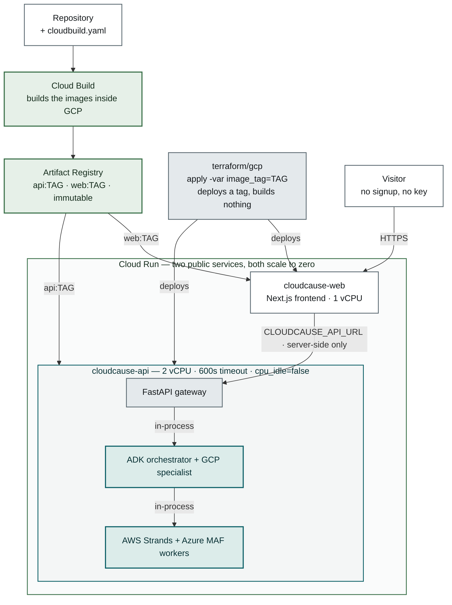

# Deployment runbook

The live deployment on Cloud Run, and the mistakes that are easy to make against
it. [docs/usage.md](usage.md#deploying-to-cloud-run) has the first-time setup;
this page is for changing something that is already running.

## What is deployed

| | |
| --- | --- |
| GCP project | `cloudcause-prod` |
| Region | `us-central1` |
| Services | `cloudcause-api` (gateway), `cloudcause-web` (frontend) |
| Registry | `us-central1-docker.pkg.dev/cloudcause-prod/cloudcause` |
| Source of truth | [`terraform/gcp`](../terraform/gcp) |

The frontend URL is linked from the [README](../README.md#live-demo) and shared
publicly. **Treat it as a permanent address.**

## Three commands, three different effects

The most common confusion is assuming a change took effect when it did not.
Editing and committing files changes nothing in GCP. There are three separate
boundaries and none of them is git:

| Command | What it changes | When it is needed |
| --- | --- | --- |
| `git commit` | Nothing in GCP, ever | Always, but it is not a deploy |
| `gcloud builds submit` | Builds a new image into Artifact Registry | Only when application code changed |
| `terraform apply` | The running services | Every change — config-only changes need this alone |

So a change to an env var, a scaling setting, or a Terraform variable needs
`terraform apply` and no rebuild. A change to Python or TypeScript needs a build
with a **new** `image_tag` first, then an apply.

## Applying a change

Terraform takes its inputs from `TF_VAR_`-prefixed environment variables, which
keeps model keys out of shell history and out of process arguments. They live
only in the shell that set them, so **every new terminal needs them again**:

```powershell
$env:TF_VAR_project_id     = 'cloudcause-prod'
$env:TF_VAR_region         = 'us-central1'
$env:TF_VAR_image_tag      = (git rev-parse --short HEAD)
$env:TF_VAR_openai_api_key = $env:OPENAI_API_KEY   # optional
$env:TF_VAR_google_api_key = $env:GOOGLE_API_KEY   # optional

cd terraform\gcp
terraform apply
```

If you keep a helper script for this, **dot-source it** — `. .\local\load-env.ps1`,
not `.\local\load-env.ps1`. The leading `. ` is not decoration: without it the
script runs in a child scope and every variable it sets is discarded on exit, so
Terraform prompts for `image_tag` and deploys with no model keys.

`local/` is gitignored; anything in it is this operator's own working copy, not
part of the repository.

### Read the plan before typing `yes`

A config-only change should read:

```
Plan: 0 to add, 1 to change, 0 to destroy.
```

Check three things:

1. **Nothing under "to destroy".** Destroying either Cloud Run service issues a
   **new URL** on the next apply. The published link breaks and re-applying does
   not bring it back. Stop and work out why rather than confirming.
2. **The `image` line is unchanged**, unless you just built a new tag. If
   Terraform wants to change it, `TF_VAR_image_tag` has drifted — usually
   because a tag derived from `git rev-parse` moves with every commit, and you
   have committed since. Applying anyway deploys an image that was never
   built. Pin it:
   `terraform apply "-var=image_tag=<the deployed tag>"`.
3. **The changed lines are the ones you intended.**

## `-var` does not persist

A `-var` flag applies to one command only. The next bare `terraform apply`
reverts to the default in `variables.tf` and can silently undo the change.

Anything that should stay true belongs in `variables.tf` as a default, not in a
flag you have to remember. Two defaults were moved there for exactly this
reason: `uploads_enabled` and `api_min_instances`.

## Never `terraform destroy` this project

Course material and lab guides end with `terraform destroy` to stop charges.
That advice does not apply here: the URL is published, and a destroy is not
recoverable by re-applying because the new services get a different address.

To reduce cost without tearing anything down, change scaling instead — see below.

## The cost lever

`api_min_instances` is the one setting with a standing bill attached. The gateway
runs 2 vCPU and 2 GiB with `cpu_idle = false`, so a warm instance is billed
continuously whether or not anyone visits.

| Setting | Idle cost | First visit after idle |
| --- | --- | --- |
| `api_min_instances = 0` (default) | ~$0 | image pull, then the startup probe |
| `api_min_instances = 1` | ~$100/month | Instant |

Zero is the default because the idle bill is certain and the cold start is
occasional.

**What the cold start actually is.** It is dominated by pulling the image, not by
starting the process: the gateway answers `/health` about 4 seconds after the
container starts, measured locally with the image already pulled.

That 4s is process readiness, not time to first response. Cloud Run only routes
traffic once the startup probe passes, and that probe waits 10s before its first
check and 10s between checks, so a visitor waits the pull plus at least one probe
interval. Treat the real figure as request latency measured against a cold
revision rather than as the sum of these parts.

This document previously said the delay was the gateway importing three agent
frameworks at boot. That was wrong — every framework import is lazy, inside the
function that builds a live agent, so a stub-mode run never imports one at all.

That correction is what made the image worth attacking, and it went from **4.09 GB
to 487 MB**:

| Change | Saved | Why |
| --- | --- | --- |
| `UV_NO_CACHE=1` | ~900 MB | uv's wheel cache is build-time scaffolding that was shipped in the layer |
| Create the runtime user first, `COPY --chown` | ~950 MB | the old trailing `chown -R /app` rewrote metadata on every file, and overlayfs stores a modified file as a whole new copy — a second copy of the venv |
| `agent-framework-core` + `-openai` instead of `agent-framework` | ~2.2 GB | the `agent-framework` distribution is a 6 KB shim depending on `agent-framework-core[all]`, and `all` pulls 29 provider integrations (Claude, Copilot Studio, Bedrock, Gemini, Mistral, Ollama, Redis, DevUI) that nothing imports |

Re-measure the real cold start on the next deploy; the startup probe still allows
~130s, which is now generous rather than necessary.

Raise it while actively sharing the link, then drop back:

```powershell
terraform apply "-var=api_min_instances=1"   # warm
terraform apply                              # back to the default
```

Verify the real numbers in **Billing → Reports** grouped by SKU rather than
trusting the estimate above.

## Why there is no database and no Redis up here

Both exist in the codebase and neither is deployed. That is a decision, not an
omission, and it is stable at this size.

**History is `CLOUDCAUSE_HISTORY_BACKEND = memory`**, per-instance and lost on
every revision and scale-to-zero. A reviewer runs an investigation and reads the
dossier in one session, which memory serves completely. Persisting it would mean
Cloud SQL at ~$10-25/month always-on — it does not scale to zero — plus a public
IP or a VPC connector, which is more GCP surface than the three-API ceiling in
[ADR 0012](adr/0012-cloud-deployment-is-single-process.md) allows. Firestore is
the cheap serverless option and was rejected for a different reason: it is
document-shaped, so it would mean a second store implementation beside the SQL
one rather than reusing the migrations and queries that already exist.

**Rate limiting is `CLOUDCAUSE_RATE_LIMIT_BACKEND = memory`**, which is correct
here only because `api_max_instances = 1`. Raising that ceiling requires Redis
first, or each instance enforces its own private quota.

Neither is wasted locally. `docker/docker-compose.yml` runs both, because the
distributed topology genuinely needs them: uploaded datasets have to be shared
between the gateway, the orchestrator, and both workers, and the outbound model
quota has to be shared between the three processes that make model calls. Local
Postgres and Redis back the topology this deployment does not run, and the
`postgres-storage` and `redis-rate-limit` CI jobs cover both on every push.

## Secrets on this deployment

`OPENAI_API_KEY` and `GOOGLE_API_KEY` are plain environment variables on the
revision and sit in `terraform.tfstate` in cleartext. `.gitignore` covers
`*.tfstate`, `terraform.tfstate.d/`, and `.env`; `.gcloudignore` includes
`.gitignore` so an untracked `.env` is never uploaded to Cloud Build.

Anyone who reaches the URL can spend that model credit. The only thing bounding
it is `CLOUDCAUSE_LIVE_INVESTIGATIONS_PER_HOUR`, and because the deployment does
not trust proxy headers, that limit is shared across all visitors rather than
enforced per person. Redeploying without the keys leaves a fully working demo on
deterministic playbooks.

This is the accepted trade of keeping the deployment to three GCP APIs
([ADR 0012](adr/0012-cloud-deployment-is-single-process.md)). Move to Secret
Manager before anyone else can reach the project or the state file.

## PowerShell specifics

The deployment is driven from PowerShell on Windows, where three things fail
quietly:

* **Environment variables need the `env:` prefix.** `$env:TF_VAR_project_id`,
  never `$TF_VAR_project_id`. A bare `$NAME` is an undefined PowerShell variable
  that expands to an empty string, so `gcloud` reports
  `argument VALUE: Must be specified` rather than saying the variable is unset.
* **Quote arguments containing a dot after `=`.** Unquoted,
  `-target=google_artifact_registry_repository.containers` reaches Terraform as
  `google_artifact_registry_repository` and fails with `Invalid target`. Quote
  the whole token: `"-target=google_artifact_registry_repository.containers"`.
* **`PS C:\...>` is PowerShell; `C:\...>` is Command Prompt.** Pasting PowerShell
  into cmd produces `'Get-Content' is not recognized...` on every line, which
  looks like a broken script rather than the wrong shell. Type `powershell` to
  switch.

## Common failures

| Symptom | Cause |
| --- | --- |
| Terraform prompts for `var.image_tag` | New shell; the `TF_VAR_*` variables were never set (or the helper was not dot-sourced) |
| `Invalid target "..."` naming only the resource type | Unquoted `-target` in PowerShell |
| `argument VALUE: Must be specified` from gcloud | Missing `env:` prefix |
| Cloud Build 403 on `storage.objects.get` | The Compute Engine default service account lacks `roles/cloudbuild.builds.builder`; org projects do not grant it automatically |
| UI says uploads are disabled | Running revision predates the `uploads_enabled` default; re-apply |
| Deploy succeeds but serves old code | Image tag was reused. Cloud Run compares the image string and correctly does nothing — `variables.tf` rejects `latest` for this reason |
| Image not found on apply | The build did not land where the service expects. Compare `terraform output api_image` against `gcloud artifacts docker images list` |

## Deployment topology

Google Cloud, from [`terraform/gcp/`](../terraform/gcp/), on **exactly three GCP
services and no others** — a deliberate ceiling, not a starting point
([ADR 0012](adr/0012-cloud-deployment-is-single-process.md)):

| Service | Role |
| --- | --- |
| **Cloud Run** | Two services: the Next.js frontend, and the gateway running the ADK orchestrator and both framework workers in one process |
| **Artifact Registry** | Holds the two container images the services deploy from |
| **Cloud Build** | Builds those images inside GCP, so Terraform describes infrastructure and builds nothing |

Terraform never builds an image and never holds one in state; it takes a tag and
deploys it, so `apply` needs no local Docker daemon. Splitting the two is what
keeps a redeploy honest — Cloud Run compares the image string, so the tag must be
immutable or a deploy silently changes nothing.



What is deliberately absent is as much of the point as what is present. No Secret
Manager, no per-service identities, no load balancer, no managed database: model
keys are plain environment variables on the revision and history is per-instance
memory. Those are the right answers for a portfolio demo on trial credits, and
the wrong ones for a deployment other people depend on — the reasoning and the
threshold for revisiting it are in ADR 0012 and
this runbook.

Everything else is the same build you get running it locally.
