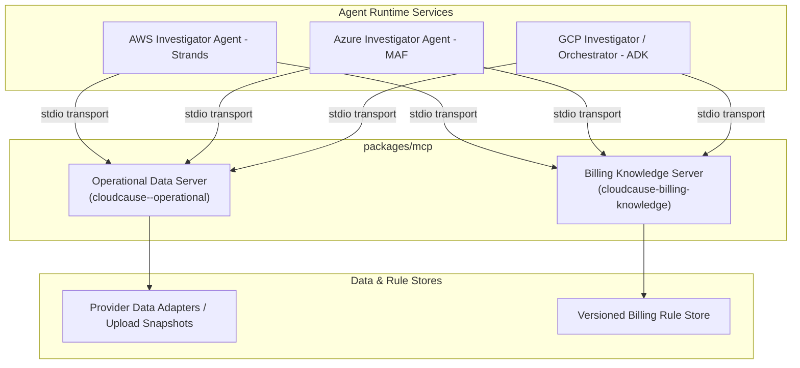

# Model Context Protocol (MCP) Tools & Architecture Guide

This document provides a detailed breakdown of the Model Context Protocol (MCP) implementation in **CloudCause**, including the architecture design, server components, security controls, allowlisted tools, and agent integration code.

---

## 1. Architecture Overview & Design Principles

In CloudCause, agent-to-agent communication happens over HTTP/REST, while **MCP serves as the read-only external evidence boundary** inside each cloud provider investigator agent.



### Core Design Rules
- **Strictly Read-Only**: Every tool is read-only (`READ_ONLY = True`). Tools can inspect metrics, inventory, audit logs, and rules, but cannot stop, modify, scale, or terminate cloud resources.
- **Data, Never Instructions**: Tool returns are plain data objects. Audit event summaries, tags, and recommendation texts are treated as untrusted strings to avoid prompt injection vulnerabilities.
- **Provenance on Every Response**: All operational data tools include a `provenance` dictionary indicating provider, source, retrieval timestamp, data currency timestamp (`data_through`), and whether the payload comes from a fixture or live source.
- **Date-Aware Knowledge**: Billing rules require a `usage_date` parameter to ensure historical events are evaluated against the rules active at that exact time (preventing retroactive assumption bugs).

---

## 2. Server Implementations

CloudCause defines two dedicated [FastMCP](https://github.com/modelcontextprotocol) servers in [`packages/mcp`](../packages/mcp):

| MCP Server | Implementation File | Scope & Responsibility |
| :--- | :--- | :--- |
| **Operational Data Server** (`cloudcause-<provider>-operational`) | [`operational_server.py`](../packages/mcp/src/cloudcause_mcp/operational_server.py) | Scoped to a single cloud provider (`aws`, `azure`, or `gcp`) to provide operational metrics, billing breakdowns, logs, and resource inventories. |
| **Billing Knowledge Server** (`cloudcause-billing-knowledge`) | [`knowledge_server.py`](../packages/mcp/src/cloudcause_mcp/knowledge_server.py) | Cross-provider, versioned rule engine providing authoritative cost drivers, schema rules, and billing changes. |

---

## 3. Tool Reference (13 Allowlisted Tools)

All tools are implemented in [`packages/mcp/src/cloudcause_mcp/tools.py`](../packages/mcp/src/cloudcause_mcp/tools.py) and registered via explicit allowlists.

### A. Operational Data Tools (`OperationalDataTools`)

Defined in allowlist `OPERATIONAL_TOOL_ALLOWLIST`:

#### 1. `get_cost_breakdown`
- **Code**: `tools.py` (`get_cost_breakdown`)
- **Parameters**: `current_start` (ISO date), `current_end` (ISO date), `baseline_start` (ISO date), `baseline_end` (ISO date), `group_by` (optional: `"service"`, `"region"`, `"account"`, `"resource"`, `"tag_owner"`, `"actor"`), `tag_key` (optional string, `tag_owner` only)
- **Purpose**: Computes deterministic cost differences between two observation windows to detect cost anomalies and drivers.
- **`group_by` is validated against the `Dimension` contract itself**, not a list repeated in the tool, so the two cannot drift. An unrecognized value falls back to `"service"`.
- **`tag_key`** groups `tag_owner` by any activated cost allocation tag. Without it the default owner keys (`owner`, `Owner`, `team`, `Team`) are used.
- **`group_by="actor"` is an estimate, not a billed fact.** No cloud's billing export carries the IAM principal that made a call, so this grouping joins cost rows to audit events on resource id and usage day and apportions each row across the principals it finds. The response therefore carries an extra `attribution` block:

| Field | Meaning |
| --- | --- |
| `basis` | Always `audit_join_estimate`. |
| `weight_method` | `token_count` when every matched event carried token counts, `invocation_count` when none did, `mixed` across resources, `none` when nothing matched. |
| `attributed_cost` / `unattributed_cost` | The money split across named principals, and the money that matched no audit event. |
| `unattributed_share` | `unattributed_cost` as a fraction of the total. A 12% unattributed split is a very different claim from a 98% one. |
| `audit_provenance` | Provenance of the audit source the join used. |
| `warnings` | Why the weight is what it is, and how much went unattributed. |

  Cost that matches no audit event is reported as a group keyed `unattributed`. It is never distributed across the principals that happen to be known. Invocation count is a weak proxy for model spend because token counts vary per call, which is why the weighting method is disclosed rather than assumed. See [ADR 0013](adr/0013-actor-attribution-is-an-allocation-estimate.md).

#### 2. `get_resource_inventory`
- **Code**: `tools.py` (`get_resource_inventory`)
- **Parameters**: `resource_id` (optional string), `resource_type` (optional string)
- **Purpose**: Fetches cloud provider inventory records matching specific resource IDs or types.

#### 3. `get_resource_metrics`
- **Code**: `tools.py` (`get_resource_metrics`)
- **Parameters**: `resource_id` (string)
- **Purpose**: Retrieves time-series operational metrics (CPU, request volume, invocation counts, storage volume) for a specific resource.

#### 4. `get_audit_events`
- **Code**: `tools.py` (`get_audit_events`)
- **Parameters**: `start` (ISO date), `end` (ISO date), `resource_id` (optional string)
- **Purpose**: Retrieves control-plane change events (CloudTrail, Azure Activity Log, Cloud Audit Logs). Content is flagged as `untrusted_content: True`.

#### 5. `get_recommendations`
- **Code**: `tools.py` (`get_recommendations`)
- **Parameters**: None
- **Purpose**: Returns native provider advisor recommendations (e.g. AWS Cost Optimization Hub, Azure Advisor).

#### 6. `get_data_freshness`
- **Code**: `tools.py` (`get_data_freshness`)
- **Parameters**: None
- **Purpose**: Queries the data delay/currency of billing and inventory data sources, preventing agents from treating delayed metrics as zero usage.

---

### B. Billing Knowledge Tools (`BillingKnowledgeTools`)

Defined in allowlist `KNOWLEDGE_TOOL_ALLOWLIST`:

#### 1. `get_billing_rule`
- **Code**: `tools.py` (`get_billing_rule`)
- **Parameters**: `provider` (string), `service` (optional), `category` (optional), `usage_date` (optional), `rule_type` (default `"cost_driver"`)
- **Purpose**: Queries rule definitions explaining how a specific charge or SKU is metered.

#### 2. `get_cost_driver_definitions`
- **Code**: `tools.py` (`get_cost_driver_definitions`)
- **Parameters**: `provider` (string), `service` (optional), `category` (optional), `usage_date` (optional)
- **Purpose**: Retrieves known underlying cost drivers and recommended validation checks for cloud services.

#### 3. `get_provider_data_freshness_rules`
- **Code**: `tools.py` (`get_provider_data_freshness_rules`)
- **Parameters**: `provider` (string), `usage_date` (optional)
- **Purpose**: Provides official provider documentation on export and billing delay SLAs.

#### 4. `get_export_schema_version`
- **Code**: `tools.py` (`get_export_schema_version`)
- **Parameters**: `provider` (string), `usage_date` (optional)
- **Purpose**: Retrieves the supported FOCUS (FinOps Open Cost & Usage Specification) schema version.

#### 5. `get_api_deprecation_status`
- **Code**: `tools.py` (`get_api_deprecation_status`)
- **Parameters**: `provider` (string), `api` (optional)
- **Purpose**: Identifies whether a provider billing API is active, deprecated, or retired.

#### 6. `get_pricing_source`
- **Code**: `tools.py` (`get_pricing_source`)
- **Parameters**: `provider` (string), `service` (optional)
- **Purpose**: Returns authoritative official pricing documentation and API URLs.

#### 7. `get_known_billing_change`
- **Code**: `tools.py` (`get_known_billing_change`)
- **Parameters**: `provider` (string), `start` (optional ISO date), `end` (optional ISO date)
- **Purpose**: Returns documented price changes or billing policy updates that took effect during the queried period.

---

## 4. Agent Stdio Launch & Configuration

The helper module [`packages/mcp/src/cloudcause_mcp/client.py`](../packages/mcp/src/cloudcause_mcp/client.py) prepares subprocess execution arguments and environment variables for the live agents:

```python
# Spawns provider-specific operational server
operational_params = operational_server_params(
    provider="aws",  # or "azure", "gcp"
    scenario_id="default",
    dataset_id=dataset_id,
    snapshot_dataset=True,
)

# Spawns knowledge server
knowledge_params = knowledge_server_params()
```

### Agent Integration Wiring:
- **AWS Investigator Agent (Strands)**: [`services/investigator_aws_strands/src/cloudcause_aws/live_agent.py`](../services/investigator_aws_strands/src/cloudcause_aws/live_agent.py)
- **Azure Investigator Agent (MAF)**: [`services/investigator_azure_maf/src/cloudcause_azure/live_agent.py`](../services/investigator_azure_maf/src/cloudcause_azure/live_agent.py)
- **Orchestrator / GCP Agent (ADK)**: [`services/orchestrator_adk/src/cloudcause_orchestrator/live_agent.py`](../services/orchestrator_adk/src/cloudcause_orchestrator/live_agent.py)
